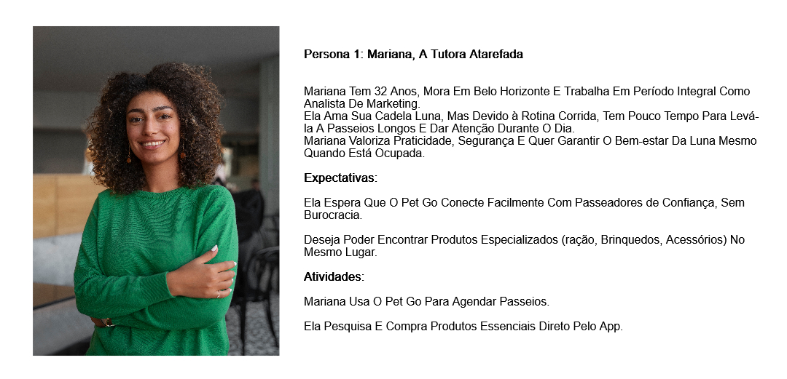
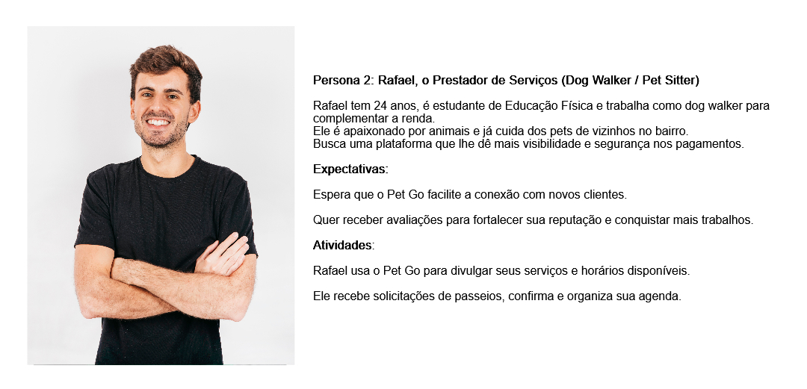
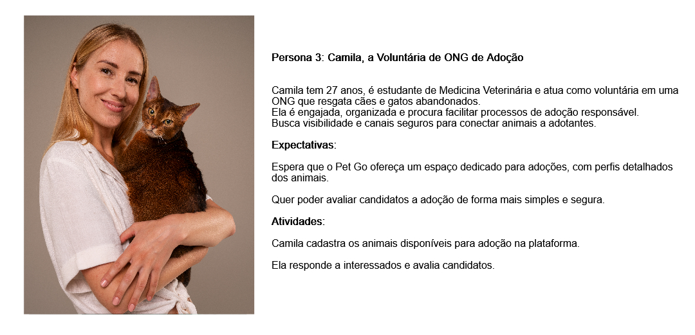

# Personas

## Persona 1: Mariana, a Tutora Atarefada

- **Perfil:**
  * Mariana tem 32 anos, mora em Belo Horizonte e trabalha em período integral como analista de marketing.  
  * Ela ama sua cadela Luna, mas devido à rotina corrida, tem pouco tempo para passeios longos e cuidados durante o dia.  
  * Valoriza praticidade, segurança e soluções que garantam o bem-estar da Luna mesmo quando está ocupada.  

- **Expectativas:**
  * Espera que o PetGo conecte facilmente com passeadores de confiança, sem burocracia.  
  * Deseja encontrar produtos especializados (ração, brinquedos, acessórios) no mesmo lugar.  

- **Atividades:**
  * Usa o PetGo para agendar passeios.  
  * Pesquisa e compra produtos essenciais direto pelo app.  

---

## Persona 2: Rafael, o Prestador de Serviços (Dog Walker / Pet Sitter)

- **Perfil:**
  * Rafael tem 24 anos, é estudante de Educação Física e atua como dog walker para complementar a renda.  
  * Apaixonado por animais, já cuida dos pets de vizinhos no bairro.  
  * Busca uma plataforma que lhe dê mais visibilidade e segurança nos pagamentos.  

- **Expectativas:**
  * Espera que o PetGo facilite a conexão com novos clientes.  
  * Quer receber avaliações para fortalecer sua reputação e conquistar mais trabalhos.  

- **Atividades:**
  * Usa o PetGo para divulgar seus serviços e horários disponíveis.  
  * Recebe solicitações de passeios, confirma e organiza sua agenda.  

---

## Persona 3: Camila, a Voluntária de ONG de Adoção

- **Perfil:**
  * Camila tem 27 anos, é estudante de Medicina Veterinária e atua como voluntária em uma ONG que resgata cães e gatos abandonados.  
  * É engajada, organizada e busca facilitar processos de adoção responsável.  
  * Precisa de canais seguros e com visibilidade para conectar animais a adotantes.  

- **Expectativas:**
  * Espera que o PetGo ofereça um espaço dedicado para adoções, com perfis detalhados dos animais.  
  * Quer avaliar candidatos à adoção de forma simples e segura.  

- **Atividades:**
  * Cadastra animais disponíveis para adoção na plataforma.  
  * Responde interessados e avalia candidatos.  

---

[Retorna](../README.md)
